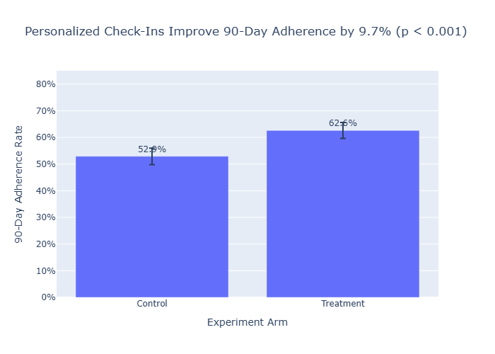
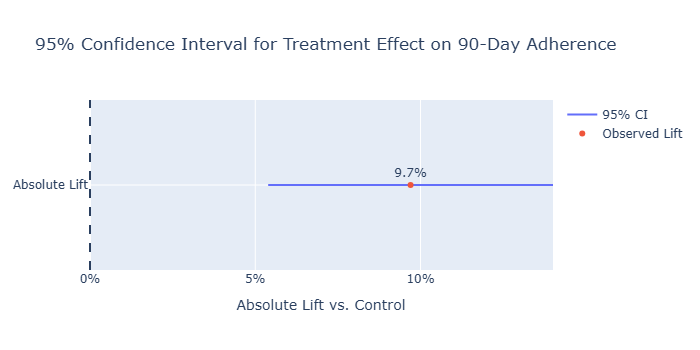
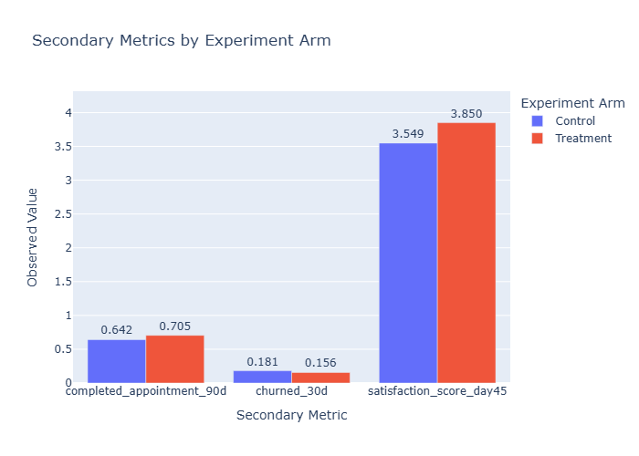
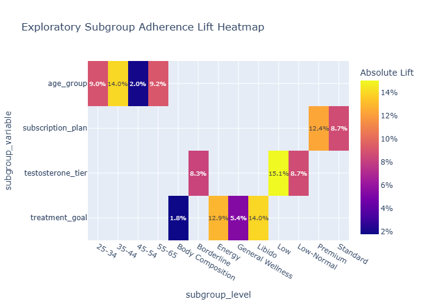
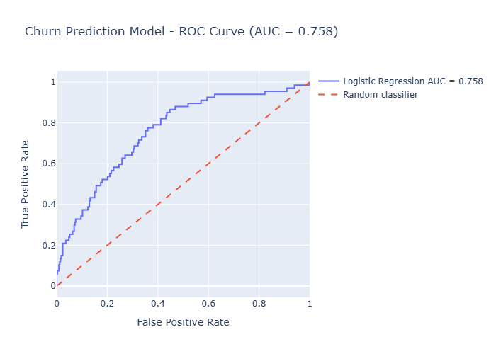
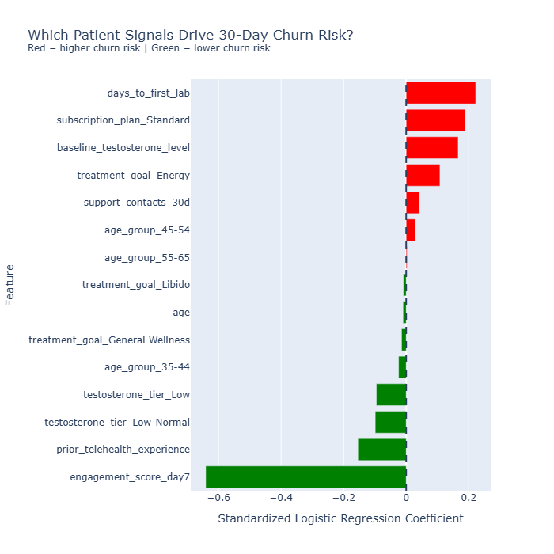

# Telehealth Patient Engagement A/B Testing and Churn Prediction Engine

A data science portfolio project that simulates a randomized telehealth patient engagement experiment, measures the causal effect of personalized check-ins on 90-day adherence, predicts 30-day churn risk, and operationalizes results through SQL cohort analysis.

---

## Tech Stack

Python · Pandas · NumPy · SciPy · Statsmodels · Scikit-learn · Matplotlib · Plotly · SQL · SQLite · Jupyter Notebook

---

## Business Problem

Telehealth subscription programs depend on patients staying engaged long enough to complete treatment protocols, attend follow-up appointments, and realize clinical benefit. Early disengagement creates both a clinical problem and a business retention problem.

This project simulates a telehealth hormone optimization patient engagement workflow. It answers two business questions:

1. Do personalized weekly check-in messages improve 90-day treatment adherence compared with generic weekly messages?
2. Which patients are most likely to churn within 30 days, and how should the care team prioritize outreach?

All data in this project is synthetic. No real patient data or PHI is used.

---

## Approach

### Phase 1 - Synthetic Cohort Generation

Generated a 2,000-patient synthetic telehealth cohort with clinically grounded features, including age, testosterone tier, treatment goal, subscription plan, prior telehealth experience, days to first lab, day-7 engagement score, and support contact volume.

Patients were randomized into Control and Treatment arms using stratified randomization across age group, treatment goal, and testosterone tier.

### Phase 2 - A/B Test Analysis

Analyzed a simulated randomized A/B test comparing generic weekly messaging against personalized weekly check-ins. The primary outcome was 90-day treatment adherence.

The experiment analysis included:

- Power analysis
- Randomization balance checks
- Two-proportion z-test for the primary outcome
- 95% confidence interval for treatment lift
- Number needed to treat
- Bonferroni-corrected secondary metric analysis
- Exploratory subgroup analysis

Because treatment assignment is randomized, the primary A/B test supports a causal interpretation of the intervention effect in this simulated setting.

### Phase 3 - Churn Prediction Model

Built an interpretable logistic regression model to predict 30-day churn risk using only pre-treatment and early patient-journey features.

The model excluded experiment arm and all downstream outcome variables to avoid leakage. The selected operating threshold prioritized recall so the care team could identify a meaningful share of likely churners for proactive outreach.

### Phase 4 - SQL Cohort Analysis

Developed four SQL queries against a SQLite database to translate analysis outputs into operational cohort views:

- Experiment KPI summary by arm
- Segment-level adherence by age group and treatment goal
- Top 50 high-risk patient outreach list
- Rolling 7-day enrollment trends

---

## Key Results

### Primary A/B Test Result: 90-Day Treatment Adherence

| Metric | Result |
|---|---:|
| Control adherence rate | 52.9% |
| Treatment adherence rate | 62.6% |
| Absolute lift | +9.7 percentage points |
| Relative lift | +18.3% |
| 95% confidence interval | +5.4 to +14.0 percentage points |
| p-value | 0.000006 |
| Number needed to treat | 11 |

Personalized weekly check-ins significantly improved 90-day treatment adherence. For every 11 patients receiving personalized check-ins, approximately one additional patient completed the 90-day treatment protocol.

---

### Secondary Metrics

| Metric | Control | Treatment | Difference | Result |
|---|---:|---:|---:|---|
| Appointment completion | 64.2% | 70.5% | +6.3 pp | Significant |
| 30-day churn | 18.1% | 15.6% | -2.5 pp | Not significant |
| Day-45 satisfaction | 3.55 | 3.85 | +0.30 points | Significant |

Secondary outcomes supported the primary finding directionally. Appointment completion and satisfaction improved significantly. Thirty-day churn decreased, but the churn reduction was not statistically significant after multiple-comparison correction.

---

### Strongest Exploratory Subgroup Lifts

| Segment | Absolute Lift |
|---|---:|
| Low testosterone tier | +15.1 pp |
| Age 35-44 | +14.0 pp |
| Libido treatment goal | +14.0 pp |
| Energy treatment goal | +12.9 pp |
| Premium subscription plan | +12.4 pp |

These subgroup results are exploratory. They should be used for rollout monitoring and future experiment planning, not as standalone confirmatory causal claims.

---

### Churn Prediction Model Performance

| Metric | Result |
|---|---:|
| CV AUC-ROC mean | 0.7771 |
| CV AUC-ROC standard deviation | 0.0495 |
| Test AUC-ROC | 0.7577 |
| Average precision | 0.4271 |
| Selected threshold | 0.20 |
| Precision | 0.3185 |
| Recall | 0.6418 |
| F1 | 0.4257 |

The churn model achieved acceptable discrimination for an interpretable logistic regression model. The selected threshold was chosen to maintain recall above 0.60, making the model useful for patient-success outreach prioritization.

---

### Full Cohort Risk Scoring

| Risk Tier | Patient Count | Observed Churn Rate |
|---|---:|---:|
| Low risk | 1,594 | 9.1% |
| Medium risk | 388 | 45.4% |
| High risk | 18 | 88.9% |

The model created meaningful separation between risk tiers. The High-risk group represented a small but highly concentrated set of patients for proactive care-team outreach.

---

### Business Impact Estimate

| Metric | Result |
|---|---:|
| High-risk patients | 18 |
| Estimated additional retained patients | 1.7 |
| Illustrative retained revenue estimate | $786 |

Illustrative retained revenue estimate using an assumed $150/month subscription value.

This is an illustrative estimate only and should not be interpreted as a real financial forecast.

---

## Business Recommendation

In this simulated setting, personalized weekly check-ins should be advanced as the preferred engagement strategy because they produced a statistically significant and operationally meaningful improvement in 90-day adherence.

Recommended next actions:

1. Roll out personalized check-ins with monitoring of adherence, appointment completion, churn, and satisfaction.
2. Prioritize Low testosterone, Libido goal, Energy goal, and age 35-44 segments for follow-up testing because they showed the strongest exploratory lifts.
3. Use the churn model to generate a recurring high-risk outreach list for care-team prioritization.
4. Use SQL cohort outputs to monitor performance by arm, segment, risk tier, and enrollment trend.

---

## Repository Structure

```text
Health-AB-testing-retention/
│
├── README.md
├── requirements.txt
├── run_pipeline.py
├── .gitignore
│
├── data/
│   └── processed/
│       ├── synthetic_patient_cohort.csv
│       └── scored_patient_cohort.csv
│
├── docs/
│   ├── data_dictionary.md
│   ├── findings_memo.md
│   ├── resume_bullets.md
│   └── architecture_diagram.md
│
├── notebooks/
│   └── 01_ab_test_and_churn_analysis.ipynb
│
├── outputs/
│   ├── hone_synthetic.db
│   ├── figures/
│   │   ├── adherence_by_arm.png
│   │   ├── adherence_lift_confidence_interval.png
│   │   ├── secondary_metrics_by_arm.png
│   │   ├── subgroup_lift_heatmap.png
│   │   ├── roc_curve.png
│   │   ├── precision_recall_curve.png
│   │   ├── calibration_curve.png
│   │   ├── confusion_matrix.png
│   │   └── feature_importance.png
│   └── tables/
│       ├── power_analysis_results.csv
│       ├── randomization_balance_table.csv
│       ├── primary_metric_results.csv
│       ├── secondary_metric_results.csv
│       ├── subgroup_analysis_results.csv
│       ├── feature_importance.csv
│       ├── business_impact_estimate.csv
│       ├── sql_cohort_summary.csv
│       ├── sql_segment_adherence.csv
│       ├── sql_high_risk_patients.csv
│       └── sql_rolling_enrollment.csv
│
├── sql/
│   ├── cohort_summary.sql
│   ├── segment_adherence.sql
│   ├── high_risk_patients.sql
│   └── rolling_enrollment.sql
│
└── src/
    ├── __init__.py
    └── data_generation/
        ├── __init__.py
        ├── distributions.py
        ├── randomization.py
        └── generate_cohort.py

```

---

## Key Figures

### 90-Day Adherence by Experiment Arm



### Treatment Lift Confidence Interval



### Secondary Metrics by Arm



### Subgroup Lift Heatmap



### Churn Model ROC Curve



### Churn Model Feature Importance



---

## Limitations

This project uses synthetic data, so the results are illustrative rather than empirically validated on real patients. No real patient data, names, addresses, medical record numbers, or PHI are used.

The primary A/B test supports a causal interpretation in this simulated setting because treatment assignment is randomized. However, a real-world rollout would require validation on actual patient data with a pre-registered analysis plan.

Subgroup analyses are exploratory and subject to multiple-comparison risk. The strongest subgroup lifts should be treated as hypotheses for rollout monitoring or future experiments, not as independently confirmed treatment effects.

The churn model is intentionally interpretable and uses logistic regression. More complex models may perform better on real-world data, but they would need careful validation, calibration checks, and monitoring before operational use.

The retained revenue estimate is illustrative only. It uses an assumed $150/month subscription value and should not be interpreted as a real financial forecast.

---

## Future Improvements

Run the experiment on real patient data with a pre-registered analysis plan.
Explore survival analysis for time-to-churn modeling.
Build an uplift model to estimate heterogeneous treatment effects for more precise targeting.

---